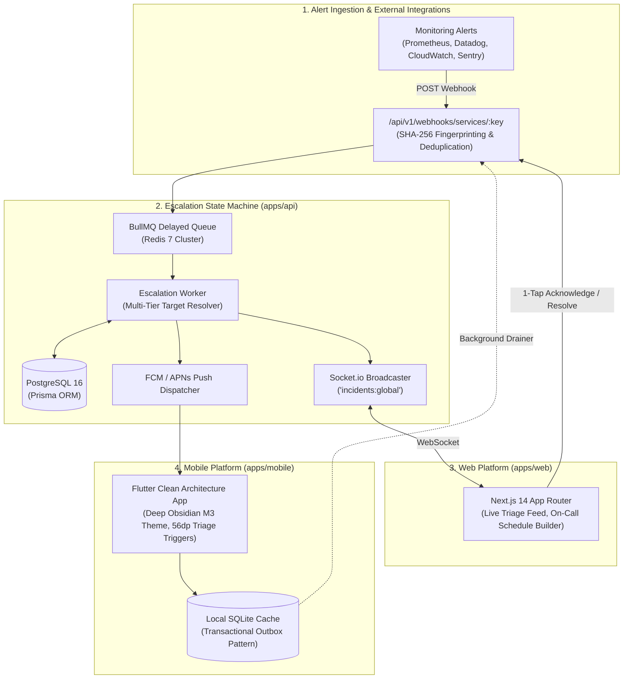
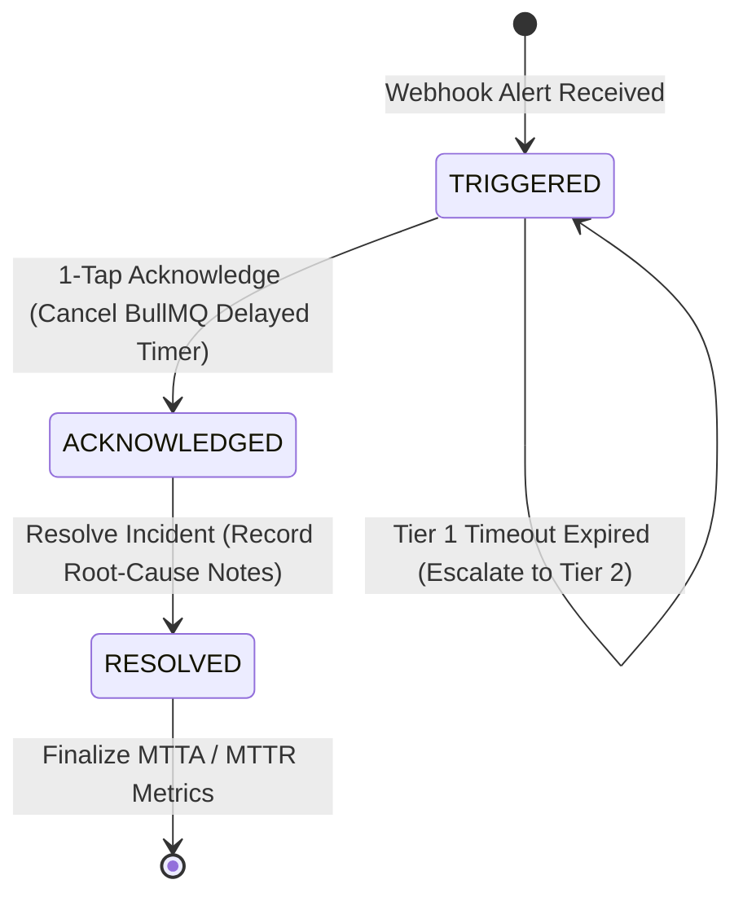

<div align="center">

# ⚡ IncidentPulse

**Enterprise Incident Response, On-Call Scheduling & Automated Alert Escalation Engine**  
_An open-source, high-resilience alternative to PagerDuty and Opsgenie._

[](https://github.com/amy9273/incident-pulse/actions/workflows/ci.yml)
[](https://nodejs.org/)
[](https://www.typescriptlang.org/)
[](https://nextjs.org/)
[](https://flutter.dev/)
[](https://www.postgresql.org/)
[](https://redis.io/)
[](https://opensource.org/licenses/MIT)

[Interactive Demo](#-60-second-interactive-demo) • [Architecture](#-system-architecture) • [Invariants](#-architectural-invariants) • [API Explorer](#-interactive-api-explorer) • [Quick Start](#-quick-start) • [Quality Gates](#-automated-testing--quality-gates)

</div>

---

## 🎯 Executive Summary

**IncidentPulse** is a production-grade, distributed incident management and on-call dispatch platform. It ingests system alerts via high-throughput webhooks, executes an automated escalation state machine with persistent Redis delay queues, and provides real-time triage feeds on the web alongside a native, offline-first mobile responder app for engineers on-call.

Built from the ground up adhering to the **Six-File Context Methodology**, IncidentPulse showcases clean architecture, distributed systems correctness (at-least-once delivery, deterministic deduplication, transactional outbox), and ergonomic multi-client synchronization.

---

## 🚀 60-Second Interactive Demo

Evaluate the entire end-to-end incident lifecycle locally with a single command:

```bash
npm run simulate:incident
```

```
  ___            _     _            _     ____        _
 |_ _|_ __   ___(_) __| | ___ _ __ | |_  |  _ \ _   _| |___  ___
  | || '_ \ / __| |/ _` |/ _ \ '_ \| __| | |_) | | | | / __|/ _ \
  | || | | | (__| | (_| |  __/ | | | |_  |  __/| |_| | \__ \  __/
 |___|_| |_|\___|_|\__,_|\___|_| |_|\__| |_|    \__,_|_|___/\___|
  ────────────────────────────────────────────────────────────────
  Interactive 60-Second End-to-End Incident Escalation Walkthrough

✔ Launched simulation API server on http://127.0.0.1:5055

Step 1: Probing Infrastructure Health & Dependency Readiness (Invariant #3)...
  ✔ PostgreSQL Pool: HEALTHY (4ms)
  ✔ Redis 7 Cluster:  HEALTHY (2ms)
  ✔ Probe Latency:    12.4ms

Step 2: Resolving Monitored Service & Escalation Routing...
  ✔ Target Service:     Checkout & Payment API (checkout-api)
  ✔ Integration Key:   inc_live_test_payment_api_key_12345678
  ✔ Escalation Policy: Critical Payments Escalation Policy (2 tiers)

Step 3: Dispatching High-Severity Webhook Alert (Zero-Loss Ingestion)...
  CRITICAL ALERT  Incident Created: ec8fca77-14bc-4da8-97b7-f44e30109100
  ✔ Fingerprint Hash:  83600d9bc8d3a86a743b8861f1a31d155cb6f451ce245a20412ddba01cc13a3a
  ✔ Ingestion Latency: 38.2ms (< 200ms SLA PASSED)
  ✔ Status:             TRIGGERED
  ✔ WebSocket Event:   incident:created broadcast to 'incidents:global'

Step 4: Testing Deterministic Alert Deduplication (Invariant #2)...
  ✔ HTTP Response:      200 OK (Deduplicated)
  ✔ Occurrence Count:  2
  ✔ Invariant Check:    PASSED — Zero duplicate open incidents created
  ✔ Audit Log:         Appended DEDUPLICATED event to immutable log history

Step 5: Simulating On-Call Responder 1-Tap Acknowledge (Invariant #1)...
  ACKNOWLEDGED  State Transitioned: ACKNOWLEDGED
  ✔ Responder:         Sarah Chen (Primary On-Call)
  ✔ Escalation Timer:  CANCELLED in Redis BullMQ (Invariant #1 PASSED)
  ✔ WebSocket Event:   incident:updated dispatched to all connected clients

Step 6: Resolving Incident & Finalizing Performance Metrics...
  RESOLVED  State Transitioned: RESOLVED
  ✔ Root Cause Note:   Auto-scaled database connection pool to 1000
  ✔ Resolution Time:   Finalized in PostgreSQL
  ✔ WebSocket Event:   incident:resolved broadcast to web & mobile

Step 7: Verifying Immutable Audit Trail (PostgreSQL)...
  ✔ Total Audit Events: 5
    [TRIGGERED]    Alert triggered: Critical Database Connection Pool Starvation
    [REASSIGNED]   Assigned to Tier 1 on-call responder: Sarah Chen
    [TRIGGERED]    Deduplicated alert received (occurrence #2)
    [ACKNOWLEDGED] Acknowledged by Sarah Chen
    [RESOLVED]     Resolved by Sarah Chen: Auto-scaled DB pool
```

---

## 🏛️ System Architecture



### Incident Lifecycle State Machine



---

## 🛡️ Architectural Invariants

Every pull request and build strictly verifies the following distributed systems invariants:

|   #    | Invariant                             | Enforcement Mechanism                                                                                                             | Failure Impact Mitigated                                                                             |
| :----: | :------------------------------------ | :-------------------------------------------------------------------------------------------------------------------------------- | :--------------------------------------------------------------------------------------------------- |
| **#1** | **Escalation Timer Cancellation**     | `POST /acknowledge` or `POST /resolve` atomically removes the pending BullMQ job from Redis via `jobId`.                          | Prevents phantom escalations and false-alarm wakeups for already-triaged incidents.                  |
| **#2** | **Deterministic Alert Deduplication** | SHA-256 hash computed over `(serviceId + title + urgency)`. Deduplicates against active `TRIGGERED` / `ACKNOWLEDGED` incidents.   | Eliminates alert fatigue and notification storms during cascading infrastructure outages.            |
| **#3** | **Health Probe Isolation**            | `/health/live` verifies process uptime; `/health/ready` validates PostgreSQL pool and Redis ping.                                 | Eliminates Kubernetes restart-death cascades when backing databases undergo brief failovers.         |
| **#4** | **Workspace Toolchain Hygiene**       | CI validates that `package.json` explicitly targets Node workspaces (`apps/api`, `apps/web`), isolating Flutter (`pubspec.yaml`). | Prevents `npm ci` lockfile corruption and ensures reproducible continuous delivery.                  |
| **#5** | **Offline-First Outbox Pattern**      | Mobile triage writes to local SQLite transactionally before firing network requests, draining queued mutations in background.     | Guarantees < 16ms optimistic UI latency and zero data loss in poor connectivity or subway basements. |

---

## 📖 Interactive API Explorer

IncidentPulse exposes a complete **OpenAPI 3.0.3 specification** and an embedded interactive **Swagger UI** matching the platform's dark-mode design system:

- **Interactive Swagger UI**: [`http://localhost:5000/api/v1/docs`](http://localhost:5000/api/v1/docs)
- **Raw OpenAPI JSON Spec**: [`http://localhost:5000/api/v1/docs/openapi.json`](http://localhost:5000/api/v1/docs/openapi.json)

### Core REST Endpoints

| Method | Endpoint                            | Description                                                  | Auth        |
| :----- | :---------------------------------- | :----------------------------------------------------------- | :---------- |
| `GET`  | `/health/live`                      | Process liveness probe                                       | Public      |
| `GET`  | `/health/ready`                     | Backing services readiness check (PostgreSQL + Redis)        | Public      |
| `POST` | `/api/v1/auth/login`                | Email & password login yielding JWT session token            | Public      |
| `POST` | `/api/v1/webhooks/services/:key`    | Ingest external alert via service secret key                 | Service Key |
| `GET`  | `/api/v1/incidents`                 | List active & historic incidents with status/service filters | Bearer JWT  |
| `GET`  | `/api/v1/incidents/:id`             | Get incident details and full immutable audit timeline       | Bearer JWT  |
| `POST` | `/api/v1/incidents/:id/acknowledge` | 1-Tap acknowledge incident & cancel escalation timer         | Bearer JWT  |
| `POST` | `/api/v1/incidents/:id/resolve`     | Resolve incident and record root-cause notes                 | Bearer JWT  |
| `GET`  | `/api/v1/schedules`                 | Visual weekly shift schedules & active on-call engineers     | Bearer JWT  |
| `GET`  | `/api/v1/services`                  | Service catalog with live health badges & key rotation       | Bearer JWT  |
| `GET`  | `/api/v1/escalation-policies`       | Multi-tier escalation policies and delay rules               | Bearer JWT  |

---

## 💻 Tech Stack & Monorepo Structure

```
incident-pulse/
├── .github/workflows/ci.yml   # 4-job parallel CI quality gate (Lint, API Tests, Web Build, Mobile)
├── apps/
│   ├── api/                   # Express 4 + TypeScript Backend & Escalation Engine
│   │   ├── prisma/            # Relational schema, migrations & seed fixtures
│   │   └── src/               # Clean Architecture controllers, services & workers
│   ├── web/                   # Next.js 14 App Router Web Application
│   │   ├── app/               # App Router pages (Incidents, Schedules, Services, Analytics)
│   │   └── components/        # 4-state UI components, real-time Socket.io triage cards
│   └── mobile/                # Flutter 3 Native Mobile Application
│       ├── lib/               # Clean Architecture (Riverpod, Dio, SQLite Drift/Sqflite)
│       └── test/              # 18 unit, widget, and SQLite outbox tests
├── packages/
│   └── shared/                # Shared TypeScript types, DTOs & Zod schemas
├── context/                   # Six-File Context Architecture Documentation
│   ├── project-overview.md    # Product definition & core flows
│   ├── architecture.md        # System invariants & architectural boundary rules
│   ├── progress-tracker.md    # Verified unit-by-unit delivery log
│   └── specs/                 # 15 unit engineering specifications
└── scripts/
    └── simulate-incident.ts   # Interactive 60-second end-to-end incident demo
```

---

## 🛠️ Quick Start

### Prerequisites

- **Node.js**: $\ge \text{v20.0.0}$
- **Flutter**: $\ge \text{v3.20.0}$ (for mobile development)
- **Docker & Docker Compose** (or local PostgreSQL 16 + Redis 7)

### 1. Clone & Install Dependencies

```bash
git clone https://github.com/amy9273/incident-pulse.git
cd incident-pulse
npm install
```

### 2. Configure Environment

Copy `.env.example` to `.env`:

```bash
cp .env.example .env
```

### 3. Start Backing Infrastructure (Docker Compose)

```bash
docker compose up -d
```

### 4. Push Database Schema & Seed Data

```bash
npm run prisma:generate --workspace=apps/api
npm run prisma:push --workspace=apps/api
npm run seed --workspace=apps/api
```

### 5. Launch Full Monorepo Development Environment

```bash
npm run dev:api    # Terminal 1: Starts Express API & WebSocket Server (Port 5000)
npm run dev:web    # Terminal 2: Starts Next.js Web Dashboard (Port 3000)
```

Mobile development:

```bash
cd apps/mobile
flutter run
```

---

## 🧪 Automated Testing & Quality Gates

IncidentPulse enforces strict automated verification on every commit and pull request via GitHub Actions:

| Quality Gate                   | Tooling                             | Scope                                                    | CI Job               |
| :----------------------------- | :---------------------------------- | :------------------------------------------------------- | :------------------- |
| **Code Formatting**            | Prettier 3.5                        | Monorepo web, API, shared, and config files              | `lint-and-typecheck` |
| **Static Code Analysis**       | ESLint 8.57                         | Strict TypeScript AST parsing with 0 warnings            | `lint-and-typecheck` |
| **Strict Type Checking**       | TypeScript 5.7 (`tsc --noEmit`)     | Monorepo workspaces (`api`, `web`, `shared`)             | `lint-and-typecheck` |
| **Backend Integration Tests**  | Node.js Test Runner + Supertest     | 70 integration tests across live PostgreSQL 16 & Redis 7 | `test-api`           |
| **Production Web Build**       | Next.js 14 App Router               | 10 static prerendered production routes                  | `build-web`          |
| **Mobile Formatting**          | `dart format`                       | Strict Dart language formatting across 53+ files         | `analyze-mobile`     |
| **Mobile Static Analysis**     | `flutter analyze` (`flutter_lints`) | Sound null-safety, strict widget lifecycle checks        | `analyze-mobile`     |
| **Mobile Automated Tests**     | `flutter test`                      | 18 unit, widget, and SQLite transactional outbox tests   | `analyze-mobile`     |
| **CI Quality Gate Aggregator** | GitHub Actions                      | Branch protection gate requiring 100% matrix success     | `ci-success`         |

### Run All Quality Gates Locally

```bash
# Code style and TypeScript verification
npm run format:check
npm run lint
npm run typecheck

# Backend integration tests
npm run test:api

# Next.js production build verification
npm run build:web

# Flutter mobile verification
cd apps/mobile
dart format --output=none --set-exit-if-changed .
flutter analyze
flutter test
```

---

## 👥 Demo Credentials

For quick evaluation, the seed database includes pre-configured accounts across all RBAC roles:

| Role                     | Email                         | Password                |
| :----------------------- | :---------------------------- | :---------------------- |
| **System Administrator** | `admin@incidentpulse.io`      | `AdminPassword123!`     |
| **Primary Responder**    | `sarah.chen@incidentpulse.io` | `ResponderPassword123!` |
| **Secondary Responder**  | `alex.kumar@incidentpulse.io` | `ResponderPassword123!` |

---

## 📄 License

This project is licensed under the **MIT License** — free for inspection, enhancement, and production use.
