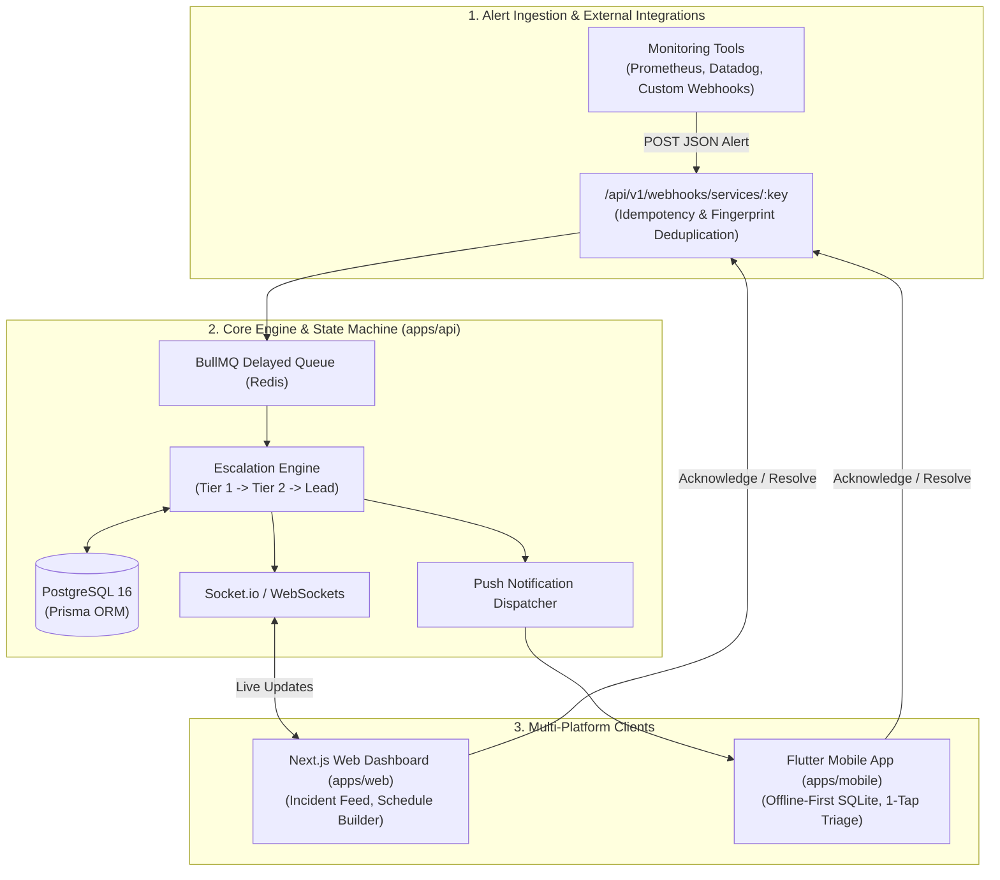

# IncidentPulse

> **Open-Source Incident Response, On-Call Scheduling & Alert Dispatch Platform**  
> _A high-resilience developer tool built with Node.js/Express (TypeScript), Next.js, Flutter, PostgreSQL, and Redis._

---

## Overview

**IncidentPulse** is an enterprise-grade on-call alerting and incident mitigation platform designed as an open-source alternative to PagerDuty and Opsgenie. It ingests monitoring alerts via webhooks, executes an automated escalation state machine with persistent Redis delay queues, and provides real-time triage feeds on the web alongside a native, offline-first mobile responder app for engineers on-call.

---

## System Architecture



---

## Tech Stack

| Domain                | Technology                                    | Purpose                                                         |
| :-------------------- | :-------------------------------------------- | :-------------------------------------------------------------- |
| **Backend API**       | Node.js, Express, TypeScript                  | REST API, webhook ingestion, correlation ID tracing             |
| **Escalation Engine** | Redis 7 + BullMQ                              | Reliable state machine timers, persistent job queues            |
| **Database**          | PostgreSQL 16 + Prisma ORM                    | Relational entities, immutable incident audit logging           |
| **Web Dashboard**     | Next.js (App Router), Tailwind CSS, shadcn/ui | Real-time incident board, interactive schedule builder          |
| **Mobile App**        | Flutter (Dart), SQLite (Drift / Sqflite)      | Offline-first triage app, background sync outbox                |
| **DevOps & CI/CD**    | GitHub Actions, Docker Compose                | 4-job automated quality gate (Lint, Typecheck, DB Tests, Build) |

---

## Production & Engineering Guardrails

This project is built following the **Six-File Context Methodology** and strict production engineering standards:

- **Deterministic Escalation Timers**: Scheduled strictly via Redis BullMQ delayed jobs—never vulnerable in-memory timers.
- **Alert Deduplication**: Ingestion fingerprints hash incoming alerts to group repeat alerts and prevent notification flooding.
- **Offline-First Outbox Pattern**: Mobile triage actions are written to local SQLite transactions first and reliably drained to the API upon reconnection.
- **Probe Isolation**: `/health/live` verifies process health only; `/health/ready` verifies database and Redis connectivity to prevent cascade restart loops.
- **Strict Git Discipline**: Direct commits to `main` are strictly forbidden; all features merge via Pull Requests after passing automated CI/CD checks.

---

## Repository Layout

```
incident-pulse/
├── .github/workflows/       # CI/CD pipeline (Lint, Typecheck, Test, Build)
├── apps/
│   ├── api/                 # Express + TypeScript backend service
│   ├── web/                 # Next.js web application
│   └── mobile/              # Flutter mobile application
├── packages/
│   └── shared/              # Shared types, DTOs, and validation schemas
├── context/                 # Six-File context documentation & architecture specs
│   ├── project-overview.md
│   ├── architecture.md
│   ├── engineering-best-practices.md
│   ├── ui-context.md
│   ├── code-standards.md
│   ├── ai-workflow-rules.md
│   ├── progress-tracker.md
│   └── specs/
│       └── 00-build-plan.md # 15 decomposed build units
├── AGENTS.md                # Agentic operating blueprint
└── docker-compose.yml       # Local PostgreSQL + Redis orchestration
```

---

## Quick Start (Development)

### Prerequisites

- **Node.js**: $\ge \text{v20}$ (v24 recommended)
- **Flutter**: $\ge \text{v3.20}$
- **Docker & Docker Compose** (or local Postgres/Redis instances)

### Setup

```bash
# 1. Clone the repository
git clone https://github.com/amy9273/incident-pulse.git
cd incident-pulse

# 2. Install workspace dependencies
npm install

# 3. Start backing services
docker compose up -d

# 4. Run database migrations
npm run db:migrate --workspace=apps/api

# 5. Start development servers
npm run dev
```

---

## License

MIT License. Free to use, inspect, and contribute.
