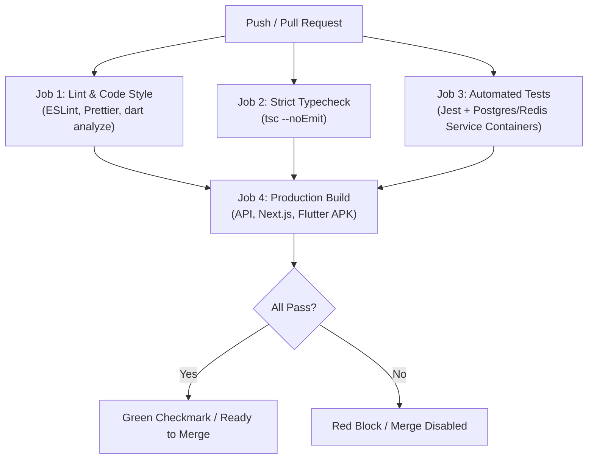

# Code Standards & CI/CD Pipeline — IncidentPulse

---

## 1. General Engineering Principles

- **Strict Typing**: Zero `any` in TypeScript. Zero untyped `dynamic` maps in Dart.
- **Fail Fast & Explicitly**: Validate all inputs at the boundary using schema parsers (Zod in TypeScript).
- **Separation of Concerns**: Controllers parse HTTP requests; Services execute business logic; Repositories/Prisma handle database queries.
- **No Console Clutter**: Use structured JSON logging (`pino` or `winston` in API). Never push raw `console.log` statements to production.

---

## 2. Backend Standards (Node.js + Express + TypeScript)

### Layer Responsibilities

```
apps/api/src/
├── controllers/   # Validate input with Zod -> call service -> send HTTP status + JSON
├── services/      # Core logic (IncidentService, EscalationService, NotificationService)
├── workers/       # BullMQ workers processing delayed jobs
├── middlewares/   # auth.middleware.ts, correlation.middleware.ts, validate.middleware.ts
├── routes/        # Express routers mapping HTTP paths to controllers
├── sockets/       # WebSocket event handlers and broadcaster
├── lib/           # prisma.ts (singleton client), redis.ts (ioredis connection pool)
├── utils/         # context.ts (AsyncLocalStorage), logger.ts (structured JSON logging)
└── errors/        # AppError custom hierarchy (NotFound, Unauthorized, Conflict)
```

### Rules

- **Route Validation**: Every mutation endpoint (`POST`, `PUT`, `PATCH`) must run a Zod validation middleware before reaching the controller.
- **Transactions**: Multi-table updates (e.g. updating incident status and appending to the audit log) must be wrapped in `prisma.$transaction()`.
- **Environment**: All environment variables are validated at boot in `src/config/env.ts` with Zod. The app exits immediately with code 1 if any required variable is missing.
- **Singletons & Connection Pooling**: `PrismaClient` and `ioredis` instances must be exported as singletons from `src/lib/` to avoid connection exhaustion against Neon PostgreSQL and Redis Cloud.
- **Correlation Tracing**: All requests and structured logs must propagate `X-Correlation-ID` using `AsyncLocalStorage` without manual prop-drilling.

---

## 3. Web Frontend Standards (Next.js + TypeScript + Tailwind)

- **State Separation**:
  - Server state: TanStack Query (`@tanstack/react-query`) with explicit cache keys (`['incidents', serviceId]`).
  - Real-time events: Centralized WebSocket listeners in custom hooks that mutate or invalidate the React Query cache.
  - Client UI state: React `useState` or Zustand for local modals, selected rows, and drawers.
- **Component Hygiene**:
  - Maximum 150 lines per component file. Extract sub-components (e.g., `<IncidentRow>`, `<AssigneePicker>`).
  - No arbitrary styling. Respect tokens in `context/ui-context.md`.
  - Always implement the **4-state UI rule** (Loading Skeleton, Empty State, Error with Retry, Populated View).

---

## 4. Mobile Standards (Flutter + Dart)

- **Clean Architecture Pattern**:
  - `presentation/`: Widgets, screens, and Riverpod state notifiers.
  - `domain/`: Pure Dart models, value objects, and repository interfaces.
  - `data/`: SQLite database client, API HTTP service (`dio`), and concrete repository implementations.
- **Offline Reliability**:
  - All read screens must load the local SQLite cache first before awaiting network responses.
  - Mutations (Ack/Resolve) update local state optimistically, save a sync action to SQLite, and dispatch to the API.

---

## 5. CI/CD Pipeline & Automated Quality Gates

Every pull request and push to `main` must pass the automated GitHub Actions pipeline. If any step fails, merging is blocked.

### Pipeline Architecture (`.github/workflows/ci.yml`)



### The 4 Automated Pipeline Jobs

#### Job 1: Lint & Style Verification

- **API & Web**: Run `eslint . --max-warnings=0` and `prettier --check .`.
- **Flutter**: Run `dart format --output=none --set-exit-if-changed .` and `flutter analyze --fatal-infos`.

#### Job 2: Typecheck Gate

- Run `tsc --noEmit` across `apps/api` and `apps/web`. Zero TypeScript compiler errors permitted.

#### Job 3: Automated Testing with Service Containers

- GitHub Actions spins up ephemeral `postgres:16` and `redis:7` containers via Docker service containers.
- Runs Prisma migrations on the test database.
- Runs backend integration tests (`jest --runInBand`):
  - Testing webhook ingestion with deduplication.
  - Testing escalation state machine transitions and delayed job scheduling.
  - Testing JWT and API key auth rejection.

#### Job 4: Production Compilation Check

- Run `npm run build` in `apps/api` (outputs clean JavaScript in `dist/`).
- Run `npm run build` in `apps/web` (Next.js production build passes with no static page generation errors).
- Run `flutter build apk --debug` in `apps/mobile` (validates Android build integrity).

## 6. Git & Commit Hygiene

- **NEVER Commit to `main` / `master` Directly**:
  - `main` is a protected production branch. Direct commits/pushes are forbidden.
  - Work on short-lived branches: `feat/unit-NN-description`, `fix/description`, `chore/description`.
  - All features merge into `main` exclusively through Pull Requests with passing CI checks.
- **Merge Strategy**: Use **Squash and Merge** to maintain a clean, linear, bisectable history on `main`. Auto-delete merged branches.
- **Commit Format**: Conventional Commits (`feat(api): ...`, `fix(web): ...`, `test(worker): ...`).
- **Atomic Commits**: Each commit should do one thing well and leave the build in a working, compiling state.
- **Clean Diff Gate**: Run `git diff` before opening a PR to guarantee zero stray `console.log` statements, commented-out dead code, or untracked temporary files.
