# Unit 03: Authentication & Service Key Middleware

---

## 1. Goal

Implement production-grade authentication and authorization mechanisms for IncidentPulse:

1. **User Authentication (JWT)**: Login endpoint (`POST /api/v1/auth/login`), profile query (`GET /api/v1/auth/me`), and JWT verification middleware (`authenticateJwt`) with role-based access control (`requireRole`).
2. **Service Key Verification (Machine-to-Machine)**: API key verification middleware (`authenticateServiceKey`) validating `Bearer inc_live_...` or `:serviceKey` route parameters for external alert webhooks.
3. **Structured Error Hierarchy & Validation**: Custom `AppError` classes with unified HTTP status mapping and reusable Zod request schema validation middleware (`validateBody`, `validateQuery`, `validateParams`).
4. **Shared Schemas & DTOs**: Synchronized auth types and Zod schemas in `packages/shared`.

---

## 2. Design & Architecture

### A. Authentication Flows

```mermaid
flowchart TD
    subgraph Human Operator
        A[User: email + password] -->|POST /api/v1/auth/login| B[Auth Controller]
        B -->|Validate & Compare bcrypt| C[Prisma User Lookup]
        C -->|Issue JWT| D[Return Token + AuthUser]
        D -->|Bearer JWT Header| E[authenticateJwt Middleware]
        E -->|Attach req.user| F[Protected Endpoints]
        F -->|requireRole| G[Role-Gated Actions]
    end

    subgraph Monitoring Machine
        H[External Alert Source] -->|Bearer inc_live_... / URL Key| I[authenticateServiceKey]
        I -->|Lookup Service & Policy| J[Prisma Service Lookup]
        J -->|Attach req.service| K[Webhook Ingestion Endpoint]
    end
```

### B. Request Context Augmentation

Express `Request` is augmented via TypeScript declaration merging (`src/types/express.d.ts`):

- `req.user`: `{ id: string; email: string; name: string; role: UserRole }`
- `req.service`: `{ id: string; name: string; slug: string; serviceKey: string; escalationPolicyId: string }`

### C. Error Handling Hierarchy (`src/errors/`)

- `AppError` (abstract base, status code, isOperational flag)
- `UnauthorizedError` (401 - Missing / invalid token or service key)
- `ForbiddenError` (403 - Insufficient role permissions)
- `NotFoundError` (404 - Resource not found)
- `ValidationError` (400 - Invalid request body / params from Zod)
- `ConflictError` (409 - Duplicate email / slug / unique violation)

---

## 3. Implementation Details

### A. Shared Auth Schemas (`packages/shared/src/schemas/auth.schema.ts`)

- `LoginRequestSchema`: `{ email: z.string().email(), password: z.string().min(6) }`
- `AuthUserDto`: `{ id: string, email: string, name: string, role: UserRole }`
- `LoginResponseDto`: `{ token: string, user: AuthUserDto }`

### B. Errors Hierarchy (`apps/api/src/errors/`)

- Export structured custom error classes deriving from `AppError`.
- Update `apps/api/src/middlewares/error.middleware.ts` to cleanly format operational errors and unexpected 500s.

### C. Validation Middleware (`apps/api/src/middlewares/validate.middleware.ts`)

- High-order middleware wrapping Zod schemas for `req.body`, `req.query`, and `req.params`.

### D. Authentication Middlewares (`apps/api/src/middlewares/`)

- `auth.middleware.ts`: `authenticateJwt` and `requireRole(allowedRoles: UserRole[])`.
- `service-key.middleware.ts`: `authenticateServiceKey` extracting key from `Authorization: Bearer inc_live_...` or `:serviceKey` route param / `x-service-key` header.

### E. Auth Service, Controller & Routes (`apps/api/src/`)

- `services/auth.service.ts`: User password verification (`bcryptjs`), JWT token signing & payload verification (`jsonwebtoken`).
- `controllers/auth.controller.ts`: Handler methods for `login` and `me`.
- `routes/auth.routes.ts`: Router mounting `/api/v1/auth/login` and `/api/v1/auth/me`.

---

## 4. Verification Checklist

- [ ] `packages/shared` compiles and exports auth schemas.
- [ ] Integration tests verify:
  - `POST /api/v1/auth/login` returns 200 with JWT for valid credentials.
  - `POST /api/v1/auth/login` returns 401 for incorrect password or non-existent user.
  - `GET /api/v1/auth/me` returns 200 with user profile for valid Bearer token.
  - `GET /api/v1/auth/me` returns 401 for missing, malformed, or expired Bearer token.
  - `requireRole` rejects unauthorized roles with 403 Forbidden.
  - `authenticateServiceKey` accepts valid `inc_live_...` key and attaches service context.
  - `authenticateServiceKey` rejects invalid, missing, or soft-deleted service keys with 401.
  - `validateBody` rejects invalid payloads with 400 Bad Request and detailed field errors.
- [ ] `npm run typecheck` passes with zero errors.
- [ ] `npm run lint` passes with zero warnings.
- [ ] `context/progress-tracker.md` updated with Unit 03 completion.
