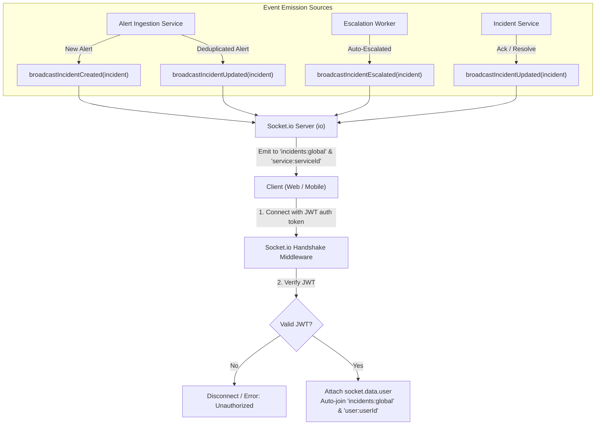

# Unit 06: Real-Time WebSocket Server (Socket.io)

---

## 1. Goal

Implement the bi-directional real-time WebSocket communication layer using Socket.io on the Express backend:

1. **Authenticated WebSocket Handshake**:
   - Secure Socket.io connection using JWT authentication (`auth.token` or `Authorization` header).
   - Rejects unauthenticated connections with clear error messages.
   - Populates `socket.data.user` with authenticated `AuthUser` context.
2. **Multi-Tenant Room Dispatching**:
   - Automatically joins the authenticated user to their individual room (`user:${userId}`) and the tenant global feed (`incidents:global`).
   - Supports client-side subscriptions to service-specific (`service:${serviceId}`) or incident-specific (`incident:${incidentId}`) rooms.
3. **Deterministic Real-Time Event Dispatchers**:
   - `incident:created`: Emitted to `incidents:global` and `service:${serviceId}` whenever a new incident is ingested.
   - `incident:updated`: Emitted whenever an alert is deduplicated, assigned, acknowledged, or resolved.
   - `incident:escalated`: Emitted whenever an escalation state machine tier transition triggers.
4. **Integration with Core Services**:
   - Hook event broadcasting into `AlertIngestionService` (`ingestAlert`), `IncidentService` (`acknowledgeIncident`, `resolveIncident`), and `EscalationService` (`executeEscalationStep`).
5. **Clean Server Lifecycle & Graceful Shutdown**:
   - Integrate Socket.io with the Node.js `http.Server` in `src/index.ts`.
   - Graceful shutdown closes all connected sockets and listeners cleanly.

---

## 2. Design & Architecture

### A. WebSocket Event Flow

### B. Standard WebSocket Events (`@incident-pulse/shared`)

| Event Name             | Direction                   | Payload                                       | Description                                             |
| :--------------------- | :-------------------------- | :-------------------------------------------- | :------------------------------------------------------ |
| `incident:created`     | Server $\rightarrow$ Client | `IncidentDetail`                              | New incident created from webhook                       |
| `incident:updated`     | Server $\rightarrow$ Client | `IncidentDetail`                              | Incident status change, deduplication, or re-assignment |
| `incident:escalated`   | Server $\rightarrow$ Client | `IncidentDetail`                              | Incident auto-escalated to higher tier                  |
| `incident:subscribe`   | Client $\rightarrow$ Server | `{ serviceId?: string, incidentId?: string }` | Client joins specific filter room                       |
| `incident:unsubscribe` | Client $\rightarrow$ Server | `{ serviceId?: string, incidentId?: string }` | Client leaves specific filter room                      |

---

## 3. Implementation Details

### A. Shared Constants & Schemas (`packages/shared/src/`)

- `packages/shared/src/constants/socket.ts`: Defines `WebSocketEvent` constants and room helper functions (`getGlobalRoom()`, `getServiceRoom(id)`, `getUserRoom(id)`, `getIncidentRoom(id)`).
- `packages/shared/src/schemas/socket.schema.ts`: Zod schema for subscription messages.

### B. Socket.io Server Architecture (`apps/api/src/sockets/`)

- `apps/api/src/sockets/socket.server.ts`:
  - `initSocketServer(httpServer: HttpServer): Server`
  - `getSocketServer(): Server | null`
  - Handshake auth middleware validating JWT.
  - Connection handler wiring room subscriptions.
- `apps/api/src/sockets/socket.emitter.ts`:
  - `broadcastIncidentCreated(incident: IncidentDetail): void`
  - `broadcastIncidentUpdated(incident: IncidentDetail): void`
  - `broadcastIncidentEscalated(incident: IncidentDetail): void`

### C. Service Integration

- In `AlertIngestionService`: Call `broadcastIncidentCreated` on new incident, and `broadcastIncidentUpdated` on deduplication.
- In `IncidentService`: Call `broadcastIncidentUpdated` after acknowledgment and resolution.
- In `EscalationService`: Call `broadcastIncidentEscalated` / `broadcastIncidentUpdated` after escalation tier transition.

### D. Server Entry Point & Lifecycle (`apps/api/src/index.ts`)

- Use `node:http` `createServer(app)` to bind both Express and Socket.io to the same HTTP port.
- Include Socket.io closing in graceful shutdown sequence.

---

## 4. Verification Checklist

- [ ] Socket.io server initializes attached to HTTP server with CORS enabled.
- [ ] Unauthenticated socket connections are rejected with authentication error.
- [ ] Valid JWT allows connection and assigns user to default rooms (`incidents:global`, `user:${userId}`).
- [ ] Emitting events reaches connected clients subscribed to global and service rooms.
- [ ] Integration tests verify:
  - Auth handshake validation (valid vs invalid tokens).
  - Room subscription and unsubscription.
  - Ingestion triggers `incident:created` broadcast to connected socket client.
  - Acknowledgment triggers `incident:updated` broadcast.
  - Auto-escalation triggers `incident:escalated` broadcast.
- [ ] `npm run typecheck` passes with zero errors.
- [ ] `npm run lint` passes with zero warnings.
- [ ] `context/progress-tracker.md` updated upon completion.
